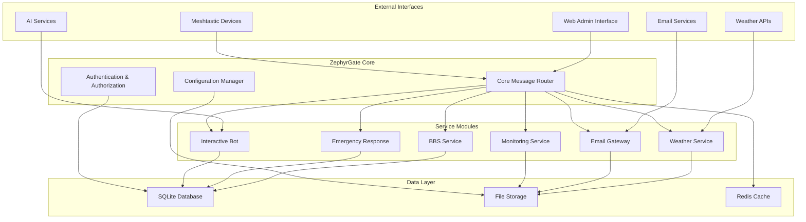

# Design Document

## Overview

ZephyrGate is a unified Meshtastic gateway application that consolidates the functionality of GuardianBridge, meshing-around, and TC2-BBS-mesh into a single, comprehensive communication platform. The system is designed with a modular, microservices-inspired architecture that can operate both online and offline, with robust error handling and automatic recovery mechanisms.

The application follows a plugin-based architecture where different functional modules can be enabled or disabled based on deployment needs. This allows for lightweight deployments in resource-constrained environments while supporting full-featured installations for comprehensive mesh network operations.

## Architecture

### High-Level Architecture



### Component Architecture

The system is built around a central message router that handles all Meshtastic communications and distributes messages to appropriate service modules. Each service module is responsible for a specific domain of functionality and can operate independently.

#### Core Components

1. **Core Message Router**: Central hub for all message processing and routing
2. **Configuration Manager**: Handles all system configuration and environment management
3. **Authentication & Authorization**: Manages user permissions and access control
4. **Plugin Manager**: Dynamically loads and manages service modules

#### Service Modules

1. **BBS Service**: Handles bulletin boards, mail, and directory services
2. **Emergency Response**: Manages SOS alerts and emergency coordination
3. **Interactive Bot**: Provides auto-responses, games, and information services
4. **Weather Service**: Fetches and distributes weather and alert information
5. **Email Gateway**: Bridges mesh network with email communications
6. **Monitoring Service**: Handles proximity alerts, file monitoring, and system health

## Components and Interfaces

### Core Message Router

The Core Message Router is the heart of the system, responsible for:

- **Message Reception**: Receives all messages from Meshtastic interfaces
- **Message Classification**: Determines message type and intended service
- **Routing Logic**: Distributes messages to appropriate service modules
- **Response Coordination**: Manages responses from multiple services
- **Rate Limiting**: Prevents message flooding and respects Meshtastic limitations

```python
class CoreMessageRouter:
    def __init__(self, config_manager, plugin_manager):
        self.config = config_manager
        self.plugins = plugin_manager
        self.interfaces = {}
        self.message_queue = asyncio.Queue()
        
    async def process_message(self, message, interface_id):
        """Process incoming message and route to appropriate services"""
        
    async def send_message(self, message, destination, interface_id):
        """Send message through specified interface with rate limiting"""
        
    def register_interface(self, interface_type, config):
        """Register a new Meshtastic interface"""
```

### Configuration Manager

Handles all system configuration with support for:

- **Environment Variables**: Primary configuration source
- **Configuration Files**: YAML/JSON configuration files
- **Runtime Updates**: Dynamic configuration changes
- **Validation**: Configuration validation and error reporting

```python
class ConfigurationManager:
    def __init__(self):
        self.config = {}
        self.watchers = []
        
    def load_config(self, sources):
        """Load configuration from multiple sources with precedence"""
        
    def get(self, key, default=None):
        """Get configuration value with dot notation support"""
        
    def set(self, key, value):
        """Set configuration value with validation"""
        
    def watch(self, key, callback):
        """Watch for configuration changes"""
```

### Plugin Manager

Manages service modules with:

- **Dynamic Loading**: Load plugins based on configuration
- **Dependency Management**: Handle plugin dependencies
- **Lifecycle Management**: Start, stop, and restart plugins
- **Health Monitoring**: Monitor plugin health and restart if needed

```python
class PluginManager:
    def __init__(self, config_manager):
        self.config = config_manager
        self.plugins = {}
        self.dependencies = {}
        
    def load_plugin(self, plugin_name, config):
        """Load and initialize a plugin"""
        
    def unload_plugin(self, plugin_name):
        """Safely unload a plugin"""
        
    def get_plugin(self, plugin_name):
        """Get reference to loaded plugin"""
```

### BBS Service Module

Implements the complete bulletin board system:

```python
class BBSService:
    def __init__(self, db_manager, config):
        self.db = db_manager
        self.config = config
        self.menu_system = MenuSystem()
        
    async def handle_message(self, message, sender_id):
        """Handle BBS-related messages"""
        
    async def sync_with_peers(self):
        """Synchronize with other BBS nodes"""
        
    def create_bulletin(self, board, subject, content, sender):
        """Create new bulletin"""
        
    def send_mail(self, recipient, subject, content, sender):
        """Send mail to user"""
```

### Emergency Response Module

Manages emergency alerts and coordination:

```python
class EmergencyResponseService:
    def __init__(self, db_manager, config):
        self.db = db_manager
        self.config = config
        self.active_incidents = {}
        
    async def handle_sos(self, sos_type, message, sender_id):
        """Handle SOS alert"""
        
    async def handle_response(self, response_type, incident_id, responder_id):
        """Handle responder acknowledgment"""
        
    async def escalate_incident(self, incident_id):
        """Escalate unacknowledged incident"""
        
    async def check_in_user(self, incident_id, user_id):
        """Perform check-in with SOS user"""
```

### Interactive Bot Module

Provides automated responses and interactive features:

```python
class InteractiveBotService:
    def __init__(self, config, ai_service=None):
        self.config = config
        self.ai = ai_service
        self.command_handlers = {}
        self.games = {}
        
    async def handle_message(self, message, sender_id, is_dm):
        """Process message for bot responses"""
        
    async def auto_respond(self, message, sender_id, altitude=None):
        """Generate automatic responses including AI responses for aircraft"""
        
    def register_command(self, command, handler):
        """Register command handler"""
        
    def register_game(self, game_name, game_class):
        """Register interactive game"""
```

## Data Models

### Core Data Models

#### User Profile
```python
@dataclass
class UserProfile:
    node_id: str
    short_name: str
    long_name: str
    email: Optional[str] = None
    phone: Optional[str] = None
    address: Optional[str] = None
    tags: List[str] = field(default_factory=list)
    permissions: Dict[str, bool] = field(default_factory=dict)
    subscriptions: Dict[str, bool] = field(default_factory=dict)
    last_seen: datetime = field(default_factory=datetime.utcnow)
    location: Optional[Tuple[float, float]] = None
```

#### Message
```python
@dataclass
class Message:
    id: str
    sender_id: str
    recipient_id: Optional[str]
    channel: int
    content: str
    timestamp: datetime
    message_type: MessageType
    interface_id: str
    hop_count: int = 0
    snr: Optional[float] = None
    rssi: Optional[float] = None
```

#### SOS Incident
```python
@dataclass
class SOSIncident:
    id: str
    incident_type: SOSType
    sender_id: str
    message: str
    location: Optional[Tuple[float, float]]
    timestamp: datetime
    status: IncidentStatus
    responders: List[str] = field(default_factory=list)
    acknowledgers: List[str] = field(default_factory=list)
    escalated: bool = False
    cleared_by: Optional[str] = None
    cleared_at: Optional[datetime] = None
```

#### BBS Message
```python
@dataclass
class BBSMessage:
    id: str
    board: str
    sender_id: str
    sender_name: str
    subject: str
    content: str
    timestamp: datetime
    unique_id: str
    read_by: List[str] = field(default_factory=list)
```

### Database Schema

The system uses SQLite for primary data storage with the following main tables:

```sql
-- User profiles and permissions
CREATE TABLE users (
    node_id TEXT PRIMARY KEY,
    short_name TEXT NOT NULL,
    long_name TEXT,
    email TEXT,
    phone TEXT,
    address TEXT,
    tags TEXT, -- JSON array
    permissions TEXT, -- JSON object
    subscriptions TEXT, -- JSON object
    last_seen DATETIME,
    location_lat REAL,
    location_lon REAL,
    created_at DATETIME DEFAULT CURRENT_TIMESTAMP
);

-- SOS incidents and emergency response
CREATE TABLE sos_incidents (
    id TEXT PRIMARY KEY,
    incident_type TEXT NOT NULL,
    sender_id TEXT NOT NULL,
    message TEXT,
    location_lat REAL,
    location_lon REAL,
    timestamp DATETIME NOT NULL,
    status TEXT NOT NULL,
    responders TEXT, -- JSON array
    acknowledgers TEXT, -- JSON array
    escalated BOOLEAN DEFAULT FALSE,
    cleared_by TEXT,
    cleared_at DATETIME,
    FOREIGN KEY (sender_id) REFERENCES users (node_id)
);

-- BBS bulletins
CREATE TABLE bulletins (
    id INTEGER PRIMARY KEY AUTOINCREMENT,
    board TEXT NOT NULL,
    sender_id TEXT NOT NULL,
    sender_name TEXT NOT NULL,
    subject TEXT NOT NULL,
    content TEXT NOT NULL,
    timestamp DATETIME NOT NULL,
    unique_id TEXT UNIQUE NOT NULL,
    FOREIGN KEY (sender_id) REFERENCES users (node_id)
);

-- BBS mail
CREATE TABLE mail (
    id INTEGER PRIMARY KEY AUTOINCREMENT,
    sender_id TEXT NOT NULL,
    sender_name TEXT NOT NULL,
    recipient_id TEXT NOT NULL,
    subject TEXT NOT NULL,
    content TEXT NOT NULL,
    timestamp DATETIME NOT NULL,
    read_at DATETIME,
    unique_id TEXT UNIQUE NOT NULL,
    FOREIGN KEY (sender_id) REFERENCES users (node_id),
    FOREIGN KEY (recipient_id) REFERENCES users (node_id)
);

-- Channel directory
CREATE TABLE channels (
    id INTEGER PRIMARY KEY AUTOINCREMENT,
    name TEXT NOT NULL,
    frequency TEXT,
    description TEXT,
    added_by TEXT,
    added_at DATETIME DEFAULT CURRENT_TIMESTAMP,
    FOREIGN KEY (added_by) REFERENCES users (node_id)
);

-- Check-in/check-out tracking
CREATE TABLE checklist (
    id INTEGER PRIMARY KEY AUTOINCREMENT,
    node_id TEXT NOT NULL,
    action TEXT NOT NULL, -- 'checkin' or 'checkout'
    notes TEXT,
    timestamp DATETIME DEFAULT CURRENT_TIMESTAMP,
    FOREIGN KEY (node_id) REFERENCES users (node_id)
);
```

## Error Handling

### Resilience Strategy

The system implements multiple layers of error handling and resilience:

1. **Circuit Breaker Pattern**: Prevents cascading failures by temporarily disabling failing services
2. **Retry Logic**: Automatic retry with exponential backoff for transient failures
3. **Graceful Degradation**: Continue core operations when non-critical services fail
4. **Health Checks**: Regular health monitoring with automatic service restart
5. **Data Validation**: Comprehensive input validation and sanitization

### Error Categories

#### Network Errors
- **Meshtastic Disconnection**: Automatic reconnection with configurable retry intervals
- **Internet Connectivity Loss**: Graceful fallback to offline mode
- **API Failures**: Use cached data and retry with backoff

#### Data Errors
- **Database Corruption**: Automatic backup restoration and data recovery
- **Configuration Errors**: Validation with clear error messages and safe defaults
- **File System Errors**: Robust file handling with atomic operations

#### Service Errors
- **Plugin Crashes**: Automatic plugin restart with failure counting
- **Memory Exhaustion**: Automatic cleanup and resource management
- **Deadlocks**: Timeout-based detection and recovery

### Error Recovery

```python
class ErrorHandler:
    def __init__(self, config):
        self.config = config
        self.circuit_breakers = {}
        self.retry_policies = {}
        
    async def handle_error(self, error, context):
        """Handle error with appropriate recovery strategy"""
        
    def create_circuit_breaker(self, service_name, failure_threshold=5):
        """Create circuit breaker for service"""
        
    async def retry_with_backoff(self, func, max_retries=3):
        """Retry function with exponential backoff"""
```

## Testing Strategy

### Unit Testing

Each module will have comprehensive unit tests covering:

- **Core Functionality**: All primary features and edge cases
- **Error Conditions**: Error handling and recovery mechanisms
- **Configuration**: Various configuration scenarios
- **Data Validation**: Input validation and sanitization

### Integration Testing

Integration tests will verify:

- **Module Interactions**: Communication between different modules
- **Database Operations**: Data persistence and retrieval
- **External APIs**: Weather services, email, and other external integrations
- **Meshtastic Communication**: Message sending and receiving

### End-to-End Testing

E2E tests will simulate:

- **Complete User Workflows**: Full user interactions from command to response
- **Emergency Scenarios**: SOS alerts and response coordination
- **BBS Operations**: Complete bulletin board and mail workflows
- **Multi-Interface Operations**: Multiple Meshtastic device scenarios

### Performance Testing

Performance tests will validate:

- **Message Throughput**: System capacity under load
- **Response Times**: Latency for various operations
- **Resource Usage**: Memory and CPU consumption
- **Concurrent Users**: Multiple simultaneous user interactions

### Test Infrastructure

```python
# Test fixtures and utilities
class TestFixtures:
    @staticmethod
    def create_test_user(node_id="!12345678"):
        """Create test user profile"""
        
    @staticmethod
    def create_test_message(content="test", sender_id="!12345678"):
        """Create test message"""
        
    @staticmethod
    def create_mock_interface():
        """Create mock Meshtastic interface"""

# Integration test base class
class IntegrationTestBase:
    def setUp(self):
        """Set up test environment"""
        
    def tearDown(self):
        """Clean up test environment"""
        
    async def send_test_message(self, content, sender_id):
        """Send test message through system"""
```

The testing strategy ensures reliability and maintainability while supporting continuous integration and deployment practices.