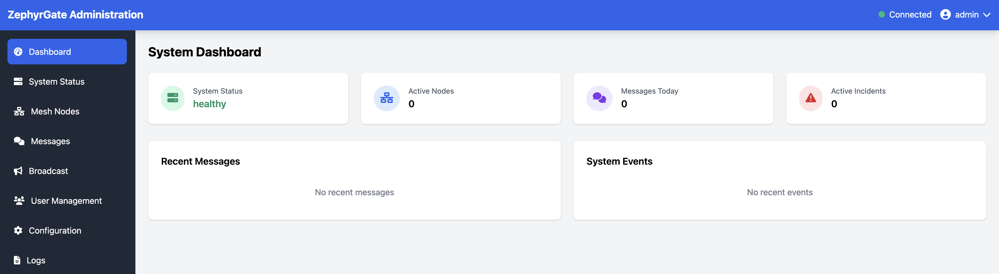
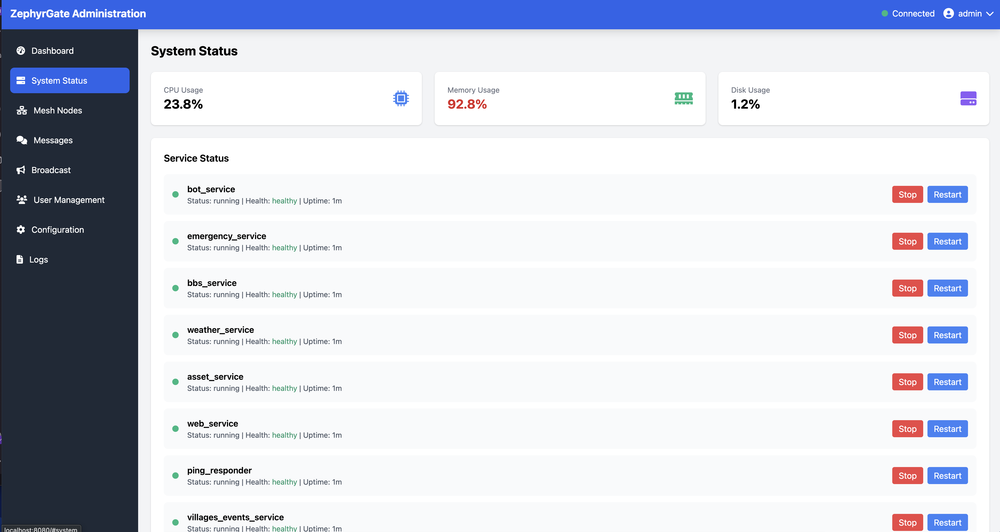
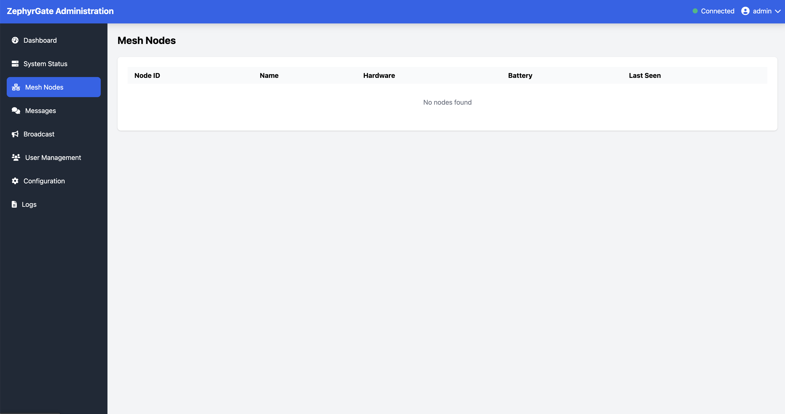
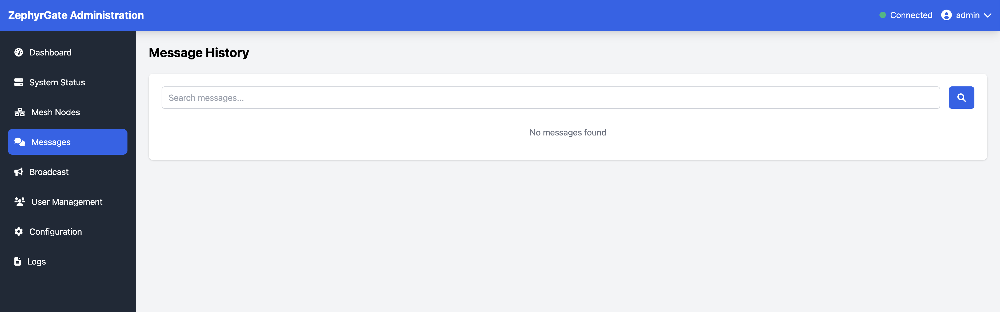
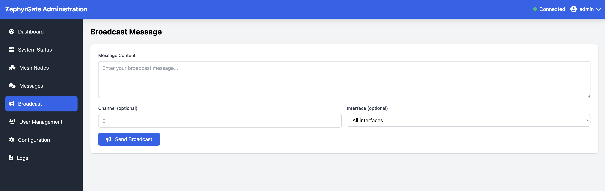
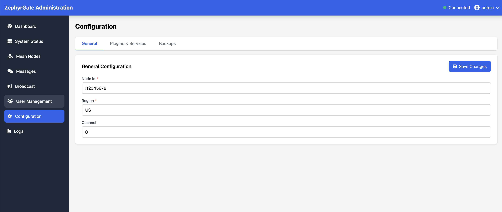
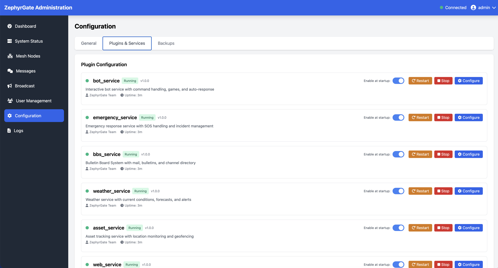
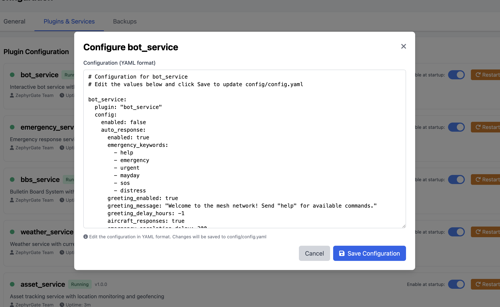
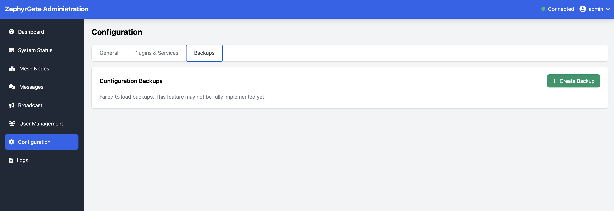
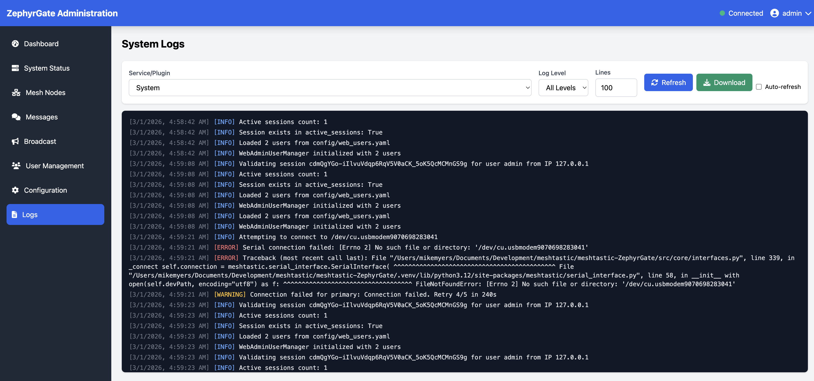

# ZephyrGate Features Overview

> Transform your Meshtastic network into a powerful communication platform with emergency response, automation, and intelligence.

---

## At a Glance

**ZephyrGate** is the most comprehensive gateway solution for Meshtastic mesh networks. Whether you're coordinating emergency response, building a community network, or integrating with existing systems, ZephyrGate provides the tools you need.

### Why ZephyrGate?

- **🤖 Intelligent Automation** - Smart auto-responses, scheduled broadcasts, and AI integration
- **📡 Network Intelligence** - Automatic topology mapping and health monitoring
- **🌐 Works Anywhere** - Full functionality with or without internet connectivity
- **🔌 Plug & Play** - Docker deployment, web interface, and extensive documentation
- **🎯 Battle-Tested** - Property-based testing ensures reliability under all conditions
- **🚨 Emergency Ready** - Built-in SOS handling, responder coordination, and automatic escalation

---

## Key Highlights

### 🤖 Intelligent Auto-Response (✅ Offline)
Never miss a message with keyword-based auto-responses, emergency detection, and customizable rules. Greet new users automatically and provide instant information. Works completely offline with optional AI enhancement when internet is available.

### 📅 Scheduled Broadcasts & Automation (✅ Offline)
Automate weather updates, status announcements, and system reports. Schedule messages by time or interval, and call plugin functions for dynamic content. Core scheduling works offline; some plugin content may require internet.

### 🗺️ Network Topology Mapping (✅ Offline)
Automatically discover and map your mesh network with intelligent traceroutes. Visualize network structure and identify connectivity issues. MQTT forwarding requires internet; local mapping works offline.

### 📡 MQTT Gateway (🌐 Requires Internet)
Forward mesh messages to MQTT brokers for cloud integration and visualization. Compatible with Meshtastic mapping tools and monitoring systems. Requires connection to MQTT broker.

### 💬 Bulletin Board System (BBS) (✅ Offline)
Classic BBS experience with message boards, private mail, and JS8Call integration. Synchronize across multiple nodes for network-wide communication. Fully functional without internet.

### 📊 Web Administration (✅ Offline)
Monitor and manage your gateway through a modern web interface. Real-time dashboards, user management, and configuration tools at your fingertips. Accessible on local network without internet.

### 🌤️ Weather & Alert Services (🌐 Requires Internet / 🔄 Cached)
Integrate NOAA, Open-Meteo, earthquake alerts, and emergency broadcast systems. Keep your network informed with automatic weather updates and severe weather warnings. Uses cached data when offline.

### 📧 Email Gateway (🌐 Requires Internet)
Bridge your mesh network to the internet with bidirectional email. Send and receive emails, manage group messaging, and enable remote communication. Requires SMTP/IMAP access.

### 🎮 Interactive Games & Education (✅ Offline)
Engage your community with card games, strategy games, and ham radio exam practice. Build camaraderie and provide entertainment during downtime. All games work completely offline.

### 🔧 Flexible Deployment (✅ Offline / 🌐 Online)
Deploy with internet for full features, or run completely offline. Two configuration templates make setup simple for any environment.

### 🔧 Asset Tracking (✅ Offline)
Track equipment, personnel, and resources with check-in/check-out workflows. Perfect for emergency response, events, and operational accountability. Fully functional without internet.

### 🚨 Emergency Response System (✅ Offline)
Coordinate life-saving operations with automatic SOS detection, responder tracking, and escalation workflows. Handle multiple simultaneous incidents with complete audit trails. Works completely offline.

---

## Core Architecture

### Unified Gateway Design

ZephyrGate consolidates multiple mesh network services into a single, cohesive application. The modular architecture allows you to enable only the features you need, reducing complexity and resource usage.

**Key Benefits:**
- **Single Application**: No need to manage multiple services
- **Modular Design**: Enable/disable features independently
- **Offline Capable**: Full functionality without internet
- **Docker Ready**: One-command deployment with Docker Compose
- **Web Management**: Configure everything through your browser

### Multi-Interface Support

Connect to your Meshtastic devices however you prefer:

- **Serial/USB**: Direct connection via USB cable (most reliable)
- **TCP/IP**: Network connection to WiFi-enabled devices
- **Bluetooth LE**: Wireless connection to compatible radios
- **Multiple Simultaneous**: Connect to multiple radios at once

Each interface type supports automatic reconnection, health monitoring, and failover capabilities.

---

## Emergency Response System

> **Internet Status:** ✅ Works Completely Offline - No internet required

### Comprehensive SOS Management

The emergency response system is designed for real-world incident coordination and works entirely on your local mesh network:

**Alert Types:**
- `SOS` - General emergency
- `SOSP` - Police emergency
- `SOSF` - Fire emergency
- `SOSM` - Medical emergency

**Features:**
- **Automatic Logging**: Every alert logged with timestamp, location, and details
- **Responder Coordination**: Track who's responding to each incident
- **Multiple Incidents**: Handle several emergencies simultaneously
- **Escalation System**: Automatic escalation for unacknowledged alerts
- **Check-in System**: Periodic check-ins with SOS users
- **Resolution Tracking**: Complete audit trail from alert to resolution

### Incident Workflow

1. **Alert Detection**: User sends SOS message
2. **Automatic Logging**: System creates incident record
3. **Responder Notification**: Designated responders are alerted
4. **Coordination**: Responders acknowledge and coordinate
5. **Check-ins**: System checks in with SOS user periodically
6. **Resolution**: Incident marked resolved with notes

### Emergency Commands

```
SOS [message]           # Trigger general emergency alert
SOSP [message]          # Police emergency
SOSF [message]          # Fire emergency
SOSM [message]          # Medical emergency
ACK [incident#]         # Acknowledge alert (responders)
RESPONDING [incident#]  # Indicate you're responding
CLEAR                   # Clear your active alert
SAFE                    # Indicate you're safe
CANCEL                  # Cancel false alarm
```

---

## Intelligent Auto-Response System

> **Internet Status:** ✅ Works Completely Offline | 🌐 Optional AI enhancement with internet

### Smart Keyword Detection

The auto-response system monitors all messages for keywords and responds automatically. Core functionality works entirely offline:

**Emergency Keywords**: Automatically detect distress signals
- `help`, `emergency`, `urgent`, `mayday`, `sos`, `distress`
- Triggers emergency escalation workflow
- Notifies responders if no acknowledgment

**Custom Rules**: Define your own keyword-based responses
- Priority-based execution (1 = highest priority)
- Rate limiting to prevent spam
- Cooldown periods between responses
- Per-user response limits

**New Node Greeting**: Welcome new users automatically
- Customizable greeting message
- Configurable delay to prevent spam
- One-time or periodic greetings

### Advanced Features

**Hop Limit Control**: Ensure responses reach the sender
- `add_one` mode: Add 1 hop to incoming message count
- `fixed` mode: Use a specific hop limit
- `default` mode: Use Meshtastic default

**Plugin Integration**: Call plugin functions in responses
- Weather forecasts on demand
- Network statistics
- Custom plugin methods

**AI Integration**: Optional AI-powered responses 🌐 Requires Internet
- Local LLM support (Ollama, etc.)
- Aircraft detection (high-altitude nodes)
- Contextual understanding
- Graceful fallback when unavailable
- **Note:** AI features require internet or local LLM server; system works fully without AI

### Example Auto-Response Rules

```yaml
custom_rules:
  # High priority: Emergency detection
  - keywords: ['help', 'emergency']
    response: "🚨 Emergency detected! Help is on the way."
    priority: 1
    cooldown_seconds: 60
    enabled: true
  
  # Medium priority: Network info
  - keywords: ['info', 'status']
    response: "📡 Network online | Send 'help' for commands"
    priority: 40
    cooldown_seconds: 120
    enabled: true
  
  # Test responses
  - keywords: ['test', 'ping']
    response: "✅ System operational"
    priority: 50
    hop_limit_mode: "add_one"  # Ensure response reaches sender
    enabled: true
```

---

## Scheduled Broadcasts & Automation

> **Internet Status:** ✅ Core scheduling works offline | 🔄 Some plugin content may need internet

### Flexible Scheduling

Automate messages and tasks with powerful scheduling options. The scheduling engine works completely offline:

**Schedule Types:**
- **Cron**: Time-based scheduling (daily, weekly, specific times)
- **Interval**: Repeat every N seconds/minutes/hours
- **One-Time**: Schedule a single future message

**Message Types:**
- **Text Messages**: Simple announcements and updates
- **Plugin Calls**: Dynamic content from plugins (weather, events, etc.)
- **Shell Commands**: Execute local commands and broadcast results

### Plugin-Powered Broadcasts

Call any plugin function to generate dynamic content:

**Weather Forecasts:** 🔄 Uses cached data offline
```yaml
- name: "Morning Weather"
  plugin_name: "weather_service"
  plugin_method: "get_forecast_report"
  plugin_args:
    user_id: "system"
    days: 3
  schedule_type: "cron"
  cron_expression: "0 7 * * *"  # 7 AM daily
  hop_limit: 3
  # Note: Uses cached weather data when offline
```

**Compact Weather (GC Format):** 🔄 Uses cached data offline
```yaml
- name: "Compact Weather"
  plugin_name: "weather_service"
  plugin_method: "get_gc_forecast"
  plugin_args:
    hours: 8
    fields: ["hour", "icon", "temp", "precip"]
  schedule_type: "cron"
  cron_expression: "0 6,12,18 * * *"  # 3x daily
  # Note: Uses cached weather data when offline
```

**Community Events:** 🔄 Uses cached data offline
```yaml
- name: "Daily Events"
  plugin_name: "villages_events_service"
  plugin_method: "get_events_report"
  plugin_args:
    format_type: "meshtastic"
    date_range: "today"
  schedule_type: "cron"
  cron_expression: "0 7 * * *"
  # Note: Uses cached events when offline
```

**Text Broadcasts:** ✅ Works completely offline
```yaml
- name: "Morning Greeting"
  message: "Good morning! Network is online."
  schedule_type: "cron"
  cron_expression: "0 8 * * *"
  channel: 0
  # Note: Static text broadcasts work without internet
```

### Hop Limit Control

Control how far your broadcasts travel:
- **1 hop**: Only direct neighbors
- **3 hops**: Standard range (default)
- **7 hops**: Maximum range (entire network)

Configure per-broadcast for optimal network usage.

---

## Weather & Alert Services

> **Internet Status:** 🌐 Requires Internet for live data | 🔄 Uses cached data when offline

### Multi-Source Weather Data

Access weather information from multiple providers with automatic caching for offline use:

**NOAA (US):** 🌐 Requires Internet
- National Weather Service data
- Highly accurate for US locations
- Severe weather alerts
- Marine forecasts
- Cached for offline access

**Open-Meteo (Worldwide):** 🌐 Requires Internet
- Free, no API key required
- Global coverage
- Hourly and daily forecasts
- Historical data
- Cached for offline access

**Offline Behavior:**
- Last successful forecast cached automatically
- Cached data displayed with timestamp
- Users notified when viewing cached data
- Automatic refresh when internet restored

**Features:**
- Location-based forecasts (ZIP, GPS, city name)
- Automatic updates (configurable interval)
- Offline caching for reliability
- Imperial or metric units

### Emergency Alert Integration

Stay informed with real-time emergency alerts (requires internet connection):

**FEMA iPAWS/EAS:** 🌐 Requires Internet
- Emergency Alert System integration
- Presidential alerts
- State and local emergencies
- AMBER alerts

**NOAA Weather Alerts:** 🌐 Requires Internet
- Severe thunderstorm warnings
- Tornado warnings
- Flash flood warnings
- Winter storm warnings
- Configurable severity threshold

**USGS Earthquake Alerts:** 🌐 Requires Internet
- Real-time earthquake detection
- Configurable magnitude threshold
- Radius-based filtering
- Automatic notifications

**USGS Volcano Alerts:** 🌐 Requires Internet
- Volcanic activity monitoring
- Eruption warnings
- Ash fall alerts

**Note:** Alert services require active internet connection. Consider disabling in offline deployments to avoid error messages.

### Weather Commands

```
wx                      # Current weather (cached if offline)
forecast [days]         # Multi-day forecast (cached if offline)
alerts                  # Active weather alerts (requires internet)
wxset [location]        # Set your location
```

---

## Email Gateway Integration

> **Internet Status:** 🌐 Requires Internet - SMTP/IMAP access required

### Bidirectional Email Bridge

Connect your mesh network to the internet with full email integration:

**Mesh to Email:** 🌐 Requires Internet
- Send emails from mesh devices
- Standard SMTP support
- Attachment support (text)
- Queue management with retry

**Email to Mesh:** 🌐 Requires Internet
- Receive emails on mesh
- IMAP/POP3 support
- Automatic polling
- Spam filtering

**Note:** Email gateway requires active internet connection and configured SMTP/IMAP servers. Disable this service in offline deployments.

### Group Messaging

Organize users with tag-based groups:

**Features:**
- Join/leave groups dynamically
- Send to entire groups
- Multiple group membership
- Group management commands

**Commands:**
```
email/to@domain.com/Subject/Message    # Send email
tagin/GROUPNAME                        # Join group
tagout                                 # Leave group
tagsend/TAG/message                    # Message group
```

### Security & Control

**Authorized Senders:**
- Whitelist email addresses
- Prevent unauthorized broadcasts
- Per-user permissions

**Blocklist:**
- Block spam senders
- Automatic filtering
- User-managed blocklist

---

## Bulletin Board System (BBS)

> **Internet Status:** ✅ Works Completely Offline - No internet required

### Classic BBS Experience

Bring the nostalgia of bulletin board systems to your mesh network. All BBS features work entirely offline:

**Features:**
- Menu-driven interface
- Public message boards
- Private mail system
- Channel directory
- Multi-node synchronization

### Message Boards

**Fixed Boards:**
- General - Community discussion
- Emergency - Emergency communications
- Trading - Buy/sell/trade
- Events - Community events
- Technical - Technical discussions

**Features:**
- Threaded discussions
- Read/unread tracking
- Search capability
- Moderation tools

### Private Mail

**Personal Messaging:**
- Send/receive private messages
- Inbox management
- Read receipts
- Cross-node delivery

### JS8Call Integration

Bridge your mesh network to HF radio:

**Features:**
- TCP API connection to JS8Call
- Monitor specific groups
- Message bridging
- Urgent message handling

**Use Cases:**
- Long-distance communication
- Emergency backup
- Ham radio integration
- Multi-band coordination

---

## Interactive Games & Education

> **Internet Status:** ✅ Works Completely Offline - All games and educational features work without internet

### Card Games

**BlackJack:**
- Classic casino game
- Betting system
- Multiple hands
- Statistics tracking

**Video Poker:**
- Jacks or Better
- Betting and payouts
- Hand rankings
- Win tracking

### Strategy Games

**Mastermind:**
- Code-breaking puzzle
- Multiple difficulty levels
- Hint system
- Leaderboards

**Tic-Tac-Toe:**
- Classic strategy game
- Player vs player
- Quick gameplay

### Simulation Games

**DopeWars:**
- Economic simulation
- Buy low, sell high
- Random events
- High score tracking

**Lemonade Stand:**
- Business simulation
- Weather affects sales
- Resource management
- Profit tracking

**Golf Simulator:**
- 18-hole golf game
- Club selection
- Wind and terrain
- Score tracking

### Word Games

**Hangman:**
- Classic word guessing
- Multiple categories
- Difficulty levels
- Hint system

### Educational Features

**Ham Radio Exam Practice:**
- FCC Technician questions
- FCC General questions
- FCC Extra questions
- Instant feedback
- Score tracking

**Quizzes:**
- General knowledge
- Technical topics
- Custom quizzes
- Leaderboards

---

## Web Administration Interface

> **Internet Status:** ✅ Works Completely Offline - Accessible on local network without internet

ZephyrGate includes a comprehensive web-based administration interface accessible at `http://localhost:8080` (default credentials: `admin` / `admin123` - change immediately after first login). The entire web interface works on your local network without requiring internet access.

### Real-Time Dashboard

The main dashboard provides an at-a-glance view of your entire gateway system with live updates and interactive monitoring.



**System Status:**
- CPU and memory usage with real-time graphs
- Network connectivity status
- Service health indicators
- Active connections and uptime
- Quick access to all major functions

**Node Information:**
- Real-time node list with status indicators
- Signal strength (SNR/RSSI) metrics
- Last seen timestamps
- Location data and battery levels

**Active Alerts:**
- Emergency incidents with priority indicators
- Weather warnings and alerts
- System alerts and notifications
- User notifications

**Message Monitoring:**
- Live message feed with auto-refresh
- Filter by channel/user
- Search history
- Export capabilities

### System Status

Monitor the health and performance of all gateway components in real-time.



The system status page displays:
- Service status for all plugins (running, stopped, error states)
- Resource utilization (CPU, memory, disk)
- Network interface status
- Database connection health
- Message queue statistics
- Uptime and performance metrics

### Mesh Network Nodes

View and manage all nodes in your mesh network with detailed information about each device.



**Node Management Features:**
- Complete list of all discovered mesh nodes
- Node details including ID, short name, and long name
- Signal quality metrics (SNR, RSSI)
- Last heard timestamps
- Battery levels and voltage
- Hardware model information
- Position data (latitude, longitude, altitude)
- Node roles and capabilities

### Message History

Access complete message history with powerful search and filtering capabilities.



**Message Monitoring:**
- Chronological message feed
- Sender and recipient information
- Channel identification
- Message content and timestamps
- Signal quality data
- Hop count information
- Filter by date range, sender, channel
- Export to CSV or JSON

### Broadcast Messages

Send messages to the mesh network directly from the web interface.



**Broadcasting Features:**
- Send immediate broadcasts to any channel
- Schedule future broadcasts
- Set message priority
- Configure hop limits
- Target specific channels or broadcast to all
- Preview messages before sending
- Message templates for common broadcasts

### User Management

Manage web interface users with role-based access control.


**User Administration:**
- Create and manage admin users
- Assign roles and permissions (Admin, Operator, Viewer)
- Enable/disable user accounts
- Password management and reset
- Track user activity and login history
- Session management
- Two-factor authentication support

**Permission Levels:**
- Admin: Full system access and configuration
- Operator: Monitor and send messages, limited config
- Viewer: Read-only access to dashboard and logs

### Configuration Management

Edit all gateway settings through an intuitive web interface with validation and backup capabilities.



**General Configuration:**
- Application settings (name, debug mode, log level)
- Meshtastic interface configuration
- Database settings
- Service enable/disable toggles
- Network and security settings



**Plugin Management:**
- View all installed plugins
- Enable/disable plugins
- Configure plugin-specific settings
- View plugin status and health
- Install new plugins
- Update existing plugins
- Remove unused plugins



**Plugin Configuration:**
- Detailed settings for each plugin
- Service-specific options (BBS, Weather, Emergency, etc.)
- API keys and credentials
- Scheduling and automation settings
- Alert thresholds and triggers
- Validation and syntax checking



**Backup & Restore:**
- Create configuration backups with descriptions
- Automatic backup before changes
- Restore previous configurations
- Export/import settings
- Backup history with timestamps
- Compare configuration versions

### System Logs

Real-time log viewing with filtering and search capabilities.



**Log Management:**
- Live log streaming with auto-scroll
- Filter by log level (DEBUG, INFO, WARNING, ERROR)
- Filter by service/component
- Search log content
- Download logs for offline analysis
- Configurable log retention
- Color-coded severity levels

### Monitoring & Analytics

**Performance Metrics:**
- Message throughput graphs
- Response times and latency
- Error rates and trends
- Resource usage over time
- Network statistics

**Usage Statistics:**
- Command usage frequency
- Popular features and services
- User activity patterns
- Network traffic analysis
- Plugin performance metrics

**Alert History:**
- Historical incident tracking
- Response times and resolution data
- Trend analysis and reporting
- Emergency response statistics

---

## Network Topology Mapping

> **Internet Status:** ✅ Local mapping works offline | 🌐 MQTT forwarding requires internet

### Automatic Network Discovery

The traceroute mapper automatically discovers and maps your mesh network topology. Core mapping functionality works completely offline:

**Intelligent Tracerouting:**
- Priority-based queue (new nodes first)
- Skip direct nodes (1-hop neighbors)
- Periodic rechecks for topology changes
- Retry logic with exponential backoff

**Network Health Protection:**
- Rate limiting (configurable traceroutes/minute)
- Quiet hours (pause during specific times)
- Congestion detection (auto-throttle)
- Emergency stop (pause if network unhealthy)

**Node Filtering:**
- Blacklist specific nodes
- Whitelist only certain nodes
- Filter by role (skip CLIENT nodes)
- SNR threshold filtering

### Topology Visualization

**MQTT Integration:** 🌐 Requires Internet
- Forward traceroutes to MQTT brokers
- Compatible with Meshtastic mapping tools
- Standard Meshtastic MQTT protocol
- JSON or Protobuf format
- **Note:** MQTT forwarding requires internet; local state tracking works offline

**State Persistence:** ✅ Works Offline
- Save node discovery state
- Traceroute history per node
- Survive restarts
- Periodic auto-save

### Configuration Options

```yaml
traceroute_mapper:
  enabled: false  # Disabled by default
  traceroutes_per_minute: 1  # Rate limit
  max_hops: 7  # Maximum trace depth
  recheck_interval_hours: 6  # Periodic updates
  skip_direct_nodes: true  # Skip 1-hop neighbors
  forward_to_mqtt: true  # Send to MQTT
```

---

## MQTT Gateway

> **Internet Status:** 🌐 Requires Internet - MQTT broker connection required

### Cloud Integration

Forward mesh messages to MQTT brokers for cloud integration and visualization:

**Features:** 🌐 Requires Internet
- One-way uplink (mesh to MQTT)
- Standard Meshtastic MQTT protocol
- JSON or Protobuf format
- TLS/SSL encryption support

**Message Filtering:**
- Filter by channel
- Filter by message type
- Selective forwarding
- Rate limiting

**Reliability:**
- Message queue (1000 messages)
- Automatic reconnection
- Exponential backoff
- Connection health monitoring

**Note:** MQTT gateway requires active internet connection to reach MQTT broker. Disable this service in offline deployments.

### MQTT Configuration

```yaml
mqtt_gateway:
  enabled: false
  broker_address: "mqtt.meshtastic.org"
  broker_port: 1883
  format: "json"  # or "protobuf"
  tls_enabled: false
  
  # Channel filtering
  channels:
    - name: "LongFast"
      uplink_enabled: true
      message_types: []  # All types
  
  # Rate limiting
  max_messages_per_second: 10
  burst_multiplier: 2
```

### Use Cases

**Network Visualization:**
- Meshtastic mapping tools
- Custom dashboards
- Real-time monitoring

**Data Analysis:**
- Message analytics
- Network performance
- Usage patterns

**Integration:**
- Home automation
- IoT platforms
- Custom applications

---

## Asset Tracking & Management

> **Internet Status:** ✅ Works Completely Offline - No internet required

### Check-In/Check-Out System

Track personnel, equipment, and resources entirely on your local mesh network:

**Features:**
- Check-in with notes
- Check-out with notes
- Current status view
- Historical tracking
- Integration with emergency system

**Commands:**
```
checkin [notes]         # Check in
checkout [notes]        # Check out
checklist              # View status
```

**Use Cases:**
- Emergency response accountability
- Event staff management
- Equipment tracking
- Operational coordination

### Asset Categories

Organize assets by type:
- Personnel
- Equipment
- Vehicles
- Supplies

**Auto-Checkout:**
- Configurable timeout (default 24 hours)
- Automatic status updates
- Notification system

---

## Data Management & Persistence

### Database Systems

**SQLite Primary Storage:**
- ACID compliance
- Automatic backups
- Corruption detection
- Schema migrations

**File Storage:**
- Configuration files
- Cache management
- State persistence
- Log files

### Backup & Recovery

**Automated Backups:**
- Scheduled database backups
- Configuration backups
- Incremental backups
- Retention policies

**Export/Import:**
- Data portability
- System migration
- Disaster recovery
- Configuration templates

---

## Security & Privacy

### Permission System

**Role-Based Access Control:**
- Admin privileges
- Trusted nodes
- Service access
- Command permissions

**Node Authentication:**
- Optional authentication
- Trusted node list
- Permission inheritance
- Access logging

### Rate Limiting

**Network Protection:**
- Per-node rate limits
- Burst allowance
- Automatic throttling
- Abuse prevention

**Service Limits:**
- Command rate limits
- API rate limits
- Resource quotas
- Fair usage policies

### Privacy Controls

**Data Protection:**
- Encrypted storage
- Secure transmission
- Privacy settings
- Data retention policies

**Audit Logging:**
- Complete activity logs
- Security events
- Access tracking
- Compliance reporting

---

## Deployment Options

### Configuration Templates

ZephyrGate provides two pre-configured templates optimized for different deployment scenarios:

**With Internet (`config-example.yaml`):** 🌐 Full Feature Set
- ✅ All core features (Emergency, BBS, Games, Bot, Asset Tracking)
- 🌐 Weather services (NOAA, Open-Meteo)
- 🌐 Emergency alerts (FEMA, NOAA, USGS)
- 🌐 Email gateway (SMTP/IMAP)
- 🌐 MQTT integration
- 🌐 AI services (optional)
- 🌐 External API plugins

**Without Internet (`config-example-no-internet.yaml`):** ✅ Offline Optimized
- ✅ All core features (Emergency, BBS, Games, Bot, Asset Tracking)
- ✅ Web interface (local network)
- ✅ Network topology mapping (local)
- ✅ Scheduled broadcasts (text-based)
- ❌ Weather services (disabled)
- ❌ Emergency alerts (disabled)
- ❌ Email gateway (disabled)
- ❌ MQTT gateway (disabled)
- ❌ AI services (disabled)
- ❌ External API plugins (disabled)

**Switching Between Configurations:**
```bash
# For internet-connected deployment
cp config/config-example.yaml config/config.yaml

# For offline deployment
cp config/config-example-no-internet.yaml config/config.yaml
```

### Docker Deployment

**One-Command Setup:**
```bash
docker-compose up -d
```

**Features:**
- Pre-built images
- Multi-architecture (ARM/x86)
- Health checks
- Auto-restart
- Volume management
- Works with or without internet (configure accordingly)

### System Requirements

**Minimum:**
- 1 CPU core
- 512 MB RAM
- 1 GB storage
- Linux/macOS/Windows
- No internet required for core features

**Recommended:**
- 2 CPU cores
- 1 GB RAM
- 5 GB storage
- Docker support
- Internet connection for enhanced features (optional)

---

## Integration Capabilities

### External Services

**Weather APIs:**
- NOAA
- Open-Meteo
- Custom providers

**Email Services:**
- SMTP/IMAP
- Gmail
- Custom servers

**AI Services:**
- Ollama (local)
- OpenAI
- Anthropic
- Custom LLMs

**Ham Radio:**
- JS8Call
- Hamlib
- APRS (planned)

### Plugin Architecture

**Modular Design:**
- Enable/disable features
- Plugin discovery
- Dependency management
- Health monitoring

**Extensibility:**
- Custom plugins
- Event system
- API integration
- Command framework

---

## Use Cases

### Emergency Services

**Search & Rescue:**
- Coordinate SAR operations
- Track responders
- Share location data
- Emergency communications

**Disaster Response:**
- Communication during outages
- Resource coordination
- Status updates
- Evacuation management

**Public Safety:**
- Law enforcement coordination
- Fire department operations
- Medical response
- Multi-agency coordination

### Community Networks

**Neighborhood Networks:**
- Local communication
- Community announcements
- Event coordination
- Information sharing

**Event Management:**
- Large event coordination
- Staff communication
- Attendee information
- Emergency procedures

### Ham Radio Operations

**Emergency Communications:**
- ARES/RACES support
- Emergency nets
- Traffic handling
- Resource coordination

**Contest Operations:**
- Multi-operator coordination
- Logging integration
- Real-time updates
- Score tracking

### Commercial Applications

**Asset Tracking:**
- Equipment management
- Personnel tracking
- Inventory control
- Operational accountability

**Remote Operations:**
- Field team coordination
- Status reporting
- Resource management
- Communication backup

---

## Offline vs Online Capabilities

ZephyrGate is designed to work in any environment - whether you have full internet connectivity, intermittent access, or no internet at all. The system gracefully adapts to available resources.

### Feature Availability Matrix

| Feature | Works Offline | Requires Internet | Notes |
|---------|:-------------:|:-----------------:|-------|
| **Core Communication** | | | |
| Emergency Response System (SOS) | ✅ | | Complete incident management without internet |
| Bulletin Board System (BBS) | ✅ | | Message boards, private mail, directory |
| Auto-Response System | ✅ | | Keyword detection and custom rules |
| Scheduled Broadcasts (Text) | ✅ | | Time-based message automation |
| Message History & Logging | ✅ | | Complete tracking and search |
| **Interactive Features** | | | |
| All Games (BlackJack, DopeWars, etc.) | ✅ | | Complete game library offline |
| Ham Radio Exam Practice | ✅ | | Full question database stored locally |
| Quizzes & Educational Content | ✅ | | All content available offline |
| **Network Management** | | | |
| Web Administration Interface | ✅ | | Full web UI on local network |
| Network Topology Mapping | ✅ | | Local network discovery and mapping |
| Node Management | ✅ | | View and manage all mesh nodes |
| System Monitoring | ✅ | | Real-time health and performance |
| Configuration Management | ✅ | | All settings and backups |
| User Management | ✅ | | Web interface users and permissions |
| **Asset & Resource Tracking** | | | |
| Asset Check-In/Check-Out | ✅ | | Personnel and equipment tracking |
| Accountability Reports | ✅ | | Current status and history |
| **Weather & Alerts** | | | |
| Weather Forecasts (NOAA) | ⚠️ | ✅ | Uses cached data when offline |
| Weather Forecasts (Open-Meteo) | ⚠️ | ✅ | Uses cached data when offline |
| Scheduled Weather Broadcasts | ⚠️ | ✅ | Broadcasts cached data when offline |
| FEMA Emergency Alerts (iPAWS) | | ✅ | Real-time alerts require internet |
| NOAA Weather Alerts | | ✅ | Severe weather warnings |
| USGS Earthquake Alerts | | ✅ | Real-time earthquake detection |
| USGS Volcano Alerts | | ✅ | Volcanic activity monitoring |
| **External Integration** | | | |
| Email Gateway (Send/Receive) | | ✅ | SMTP/IMAP access required |
| MQTT Gateway | | ✅ | MQTT broker connection required |
| MQTT Topology Forwarding | | ✅ | Cloud visualization requires internet |
| **AI & Advanced Features** | | | |
| AI-Powered Responses | | ✅ | OpenAI, Anthropic, or local LLM |
| Aircraft Detection | | ✅ | Requires AI service |
| Wikipedia Search | | ✅ | External API access required |
| Villages Events Service | ⚠️ | ✅ | Uses cached events when offline |
| **Communication Bridges** | | | |
| JS8Call Integration | ✅ | | Local TCP connection to JS8Call |
| Multi-Node BBS Sync | ✅ | | Mesh-based synchronization |

**Legend:**
- ✅ = Fully functional
- ⚠️ = Degraded mode (uses cached data when offline, full functionality with internet)
- Empty = Not available in that mode

### ✅ Works Completely Offline (No Internet Required)

These core features operate entirely on your local mesh network without any internet connection:

- **Emergency Response System** - Full SOS handling, responder coordination, and incident tracking
- **Bulletin Board System (BBS)** - Message boards, private mail, and directory services
- **Interactive Games** - All games (BlackJack, DopeWars, Golf, Hangman, etc.)
- **Auto-Response System** - Keyword detection, custom rules, and automated replies
- **Scheduled Broadcasts** - Time-based and interval-based message automation
- **Asset Tracking** - Check-in/check-out system and accountability tracking
- **Web Administration Interface** - Full web UI accessible on local network
- **Network Topology Mapping** - Discover and map mesh network structure
- **Message History & Logging** - Complete message tracking and search
- **User Management** - Web interface users and permissions
- **Configuration Management** - All settings and backups
- **Ham Radio Exam Practice** - Complete question database stored locally

### 🌐 Requires Internet Connection

These features need internet access to function:

- **Weather Services** - NOAA and Open-Meteo weather data (requires API access)
- **Emergency Alerts** - FEMA iPAWS, NOAA weather alerts, USGS earthquake/volcano alerts
- **Email Gateway** - Bidirectional email bridge (SMTP/IMAP)
- **MQTT Gateway** - Forward messages to cloud MQTT brokers
- **AI Integration** - OpenAI, Anthropic, or other cloud AI services
- **External API Plugins** - Any plugins that call external web services

### 🔄 Works With Cached Data (Degraded Mode)

These features work offline using cached data, but provide enhanced functionality with internet:

- **Weather Service** - Uses last cached forecast when offline, updates when online
- **Villages Events Service** - Shows cached events offline, fetches new events when online
- **Wikipedia Search** - No offline capability (requires internet)

### 📦 Configuration Templates

ZephyrGate includes two configuration templates to make setup easy:

**`config-example.yaml`** - Full featured configuration with internet
- All services enabled
- Weather and alert services configured
- Email gateway ready
- MQTT integration enabled
- AI services available

**`config-example-no-internet.yaml`** - Offline-optimized configuration
- Core services only (BBS, Emergency, Bot, Games)
- Weather service disabled
- Email gateway disabled
- MQTT gateway disabled
- AI services disabled
- Optimized for off-grid operation

Simply copy the appropriate template to `config/config.yaml` and customize for your needs.

---

## Getting Started

### Quick Start

1. **Install Docker** (if not already installed)
2. **Clone Repository**
   ```bash
   git clone https://github.com/yourusername/zephyrgate.git
   cd zephyrgate
   ```
3. **Choose Configuration**
   - With internet: `cp config/config-example.yaml config/config.yaml`
   - Without internet: `cp config/config-example-no-internet.yaml config/config.yaml`
4. **Edit Configuration**
   - Set your Meshtastic interface
   - Configure desired features
   - Set admin password
5. **Start ZephyrGate**
   ```bash
   docker-compose up -d
   ```
6. **Access Web Interface**
   - Open http://localhost:8080
   - Login with admin/changeme
   - Change password immediately

### Documentation

- **Quick Start Guide**: `docs/QUICK_START.md`
- **User Manual**: `docs/USER_MANUAL.md`
- **Admin Guide**: `docs/ADMIN_GUIDE.md`
- **API Documentation**: `docs/API.md`
- **Plugin Development**: `docs/PLUGIN_DEVELOPMENT.md`

### Support

- **GitHub Issues**: Report bugs and request features
- **Documentation**: Comprehensive guides and references
- **Examples**: Sample configurations and use cases
- **Community**: Join discussions and share experiences

---

## Why Choose ZephyrGate?

### Comprehensive Feature Set

ZephyrGate isn't just a gateway - it's a complete communication platform. From emergency response to entertainment, from automation to integration, ZephyrGate provides everything you need to build a powerful mesh network.

### Battle-Tested Reliability

With property-based testing covering all critical components, ZephyrGate is designed to work reliably under all conditions. Automatic error recovery, health monitoring, and graceful degradation ensure your network stays operational.

### Flexible Deployment

Whether you have internet connectivity or not, ZephyrGate adapts to your environment. Two configuration templates make setup simple, and the modular architecture lets you enable only what you need.

### Active Development

ZephyrGate is actively developed with regular updates, new features, and community feedback integration. The plugin architecture ensures extensibility for future needs.

### Open Source

ZephyrGate is open source, allowing you to inspect, modify, and contribute to the codebase. No vendor lock-in, no hidden costs, complete transparency.

---

**Ready to transform your Meshtastic network? Get started with ZephyrGate today.**
